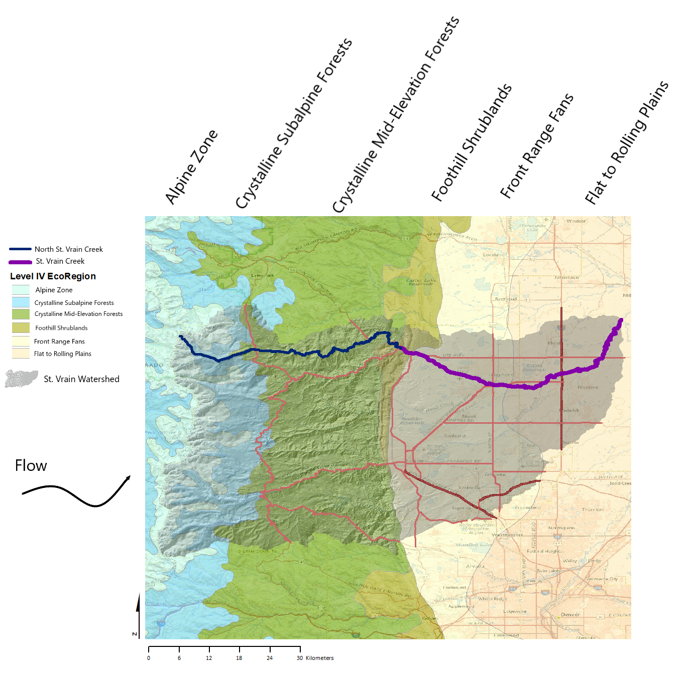

# Background {#background}

---
title: "The National Hydrography Dataset in the St. Vrain Creek Watershed"
author: "Lauren Herbine"
date: "4/27/2021"
output: html_document
---

## The St. Vrain Watershed

The St. Vrain Watershed (HUC level 8) is located in Northern Colorado along the front range and encompasses the town of Longmont. This system brings snowmelt from the peaks of the Central Rockies (12,000'-14,000'+) to the South Platte over the course of 64.2 miles. The South Platte then transports water through the the Great Plains to the Platte, which drains into the Missouri. Eventually the snow that falls at some of the highest elevations in the continental U.S. makes its way from the Missouri to the Mississippi, and finally into the Gulf of Mexico! 

This system becomes progressively urbanized as it flows out of the Rockies. In its headwater reaches, the North St. Vrain is within Park Service and Forest Service land and by the time it becomes the St. Vrain, it is solidly within private/city owned land. 

## What is NHDPlus HR?
**From the [USGS](https://www.usgs.gov/core-science-systems/ngp/national-hydrography/nhdplus-high-resolution#WhatIsIt)**

_The St. Vrain Creek Watershed displayed as upstream drainage area (square km) from the NHD+ dataset_

"The High Resolution National Hydrography Dataset Plus (NHDPlus HR) is an integrated set of geospatial data layers, including the best available National Hydrography Dataset (NHD), the 10-meter 3D Elevation Program Digital Elevation Model (3DEP DEM), and the National Watershed Boundary Dataset (WBD). The NHDPlus HR combines the NHD, 3DEP DEMs, and WBD to create a stream network with linear referencing, feature naming, "value added attributes" (VAAs), elevation-derived catchments, and other features for hydrologic data analysis. The stream network with linear referencing is a system of data relationships applied to hydrographic systems so that one stream reach "flows" into another and "events" can be tied to and traced along the network. The VAAs provide capabilities for upstream and downstream navigation with linear referencing, analysis, and modeling. The elevation derived catchments are used to associate other landscape attributes, such as land cover, with stream segments."