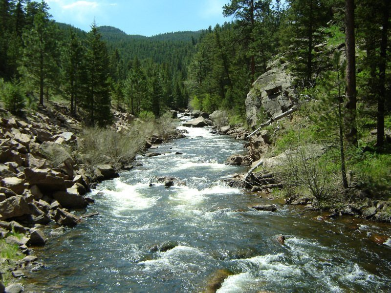

--- 
title: "NHD+ in the St. Vrain"
author: "Lauren Herbine"
date: "`r Sys.Date()`"
site: bookdown::bookdown_site
documentclass: book
bibliography: [book.bib, packages.bib]
biblio-style: apalike
link-citations: yes
description: "This is a minimal example of using the bookdown package to write a book. The output format for this example is bookdown::gitbook."
---
# Introduction

## Project Goals

The main objective of this project is to demonstrate some of the skills I have learned in "Computational Tools for Reproducible Science." I am using this opportunity to dig a little deeper into the NHD+ HR database and look at a watershed (the St. Vrain) that is within my study area- the Mississippi River Basin. This is by no means supposed to be rigorous analytical work.  

## Project Outline
This book is composed of the following additional chapters:
 
Chapter 2: Background

Chapter 3: Database creation

Chapter 4: Basin Morphometric visulizations 

Chapter 5: Analysis by EcoRegion

Chapter 6: Summary

